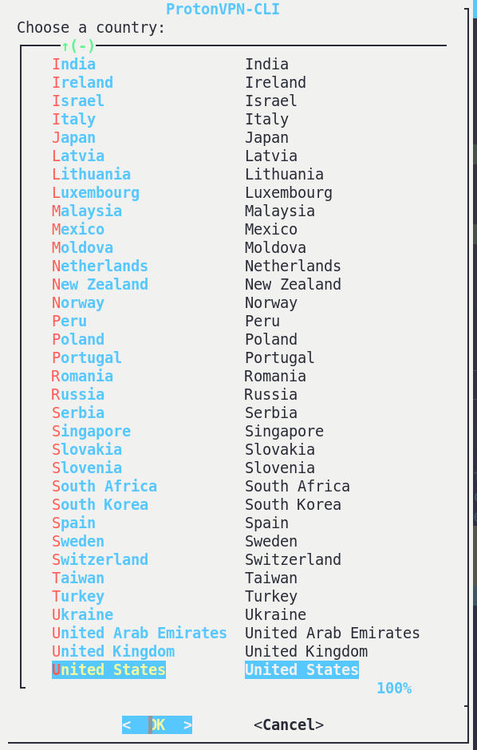
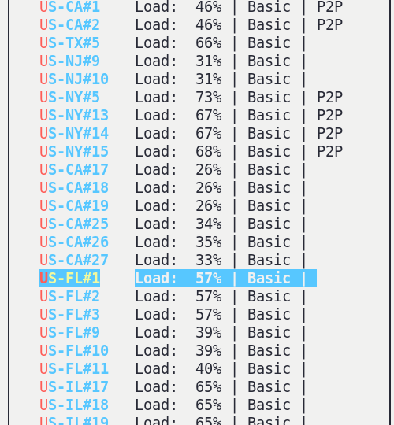
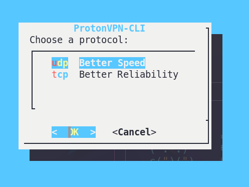
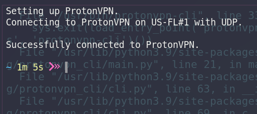

First we need to place the script that actually does the work in your documents folder, that is the ```vpncon.sh``` script above this window.  You can download it or copy and paste it into the : ```/home/user1/documents/``` or ```Home -> Documents ->``` if your using a file manager.


This is going to be a simple little task of creating some keyboard shortcuts to connect & disconnect from the vpn

Menu > Settings > System Settings or All Settings > Shortcuts > Press the  (Plus Button See Photo)


Click the + button(in previous image). The Add Custom Shortcut window will appear:
Add a custom shortcut

Type a Name to identify the shortcut, and a Command to run an application.


Click the Set Shortcut .... When the Set Custom Shortcut window opens, hold down the desired shortcut key combination.
I'd reccommend  

Connect Shortcut

```Name : Connect to ProtonVPN```

```Command : xfce4-terminal -x bash /home/user1/documents/vpncon.sh -1``` 

```Shortcut : Super/Windows Button + c```

Disconnect Shortcut

```Name : Disconnect from ProtonVPN```

```Command : xfce4-terminal -x bash /home/user1/documents/vpncon.sh -2 = Disconnect from VPN```

```Shortcut : Super/Windows Button + d```

Display Shortcuts

```Name : Keyboard Shortcuts Displayed```

```Command : xfce4-terminal -x bash /home/user1/documents/vpncon.sh -3 = Fetching Shortcuts```

```Shortcut : Super/Windows Button + s```

Run Script Standalone 

This is a choiced bash script, so there are 3 choices. Example Connect Usage : ./vpncon.sh -1  . This is 
par for the linux operating system when running applications in the terminal, option with a shorthand called
the argument.  Usually the option itself will work as well, but not in this case.

 |   option   |  argument   | 
 | :--------- | ----------: | 
 | connect    |      -1     |
 | disconnect |      -2     |
 | shortcuts  |      -3     |
  
  Steps to follow while connecting, obviously country & state are your choice, I reccommend to you to just use UDP, its much much safer and there isn't any drawbacks compared to TCP, at least not for your normal use.
  
1. Country Choice 


  
2. State Choice



3. UDP or TCP



4. Wait for confirmation


