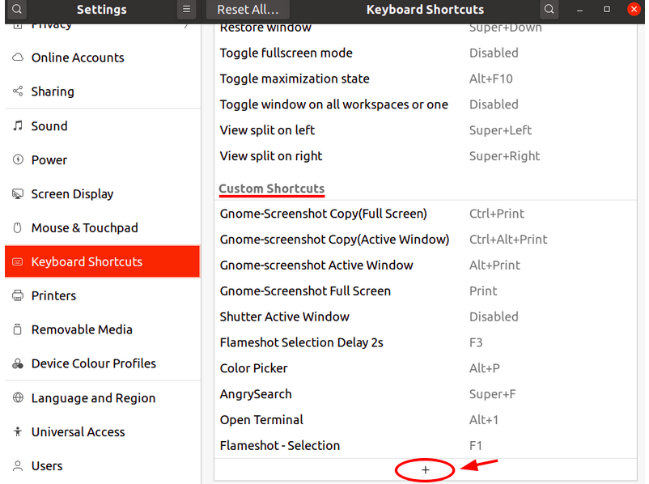
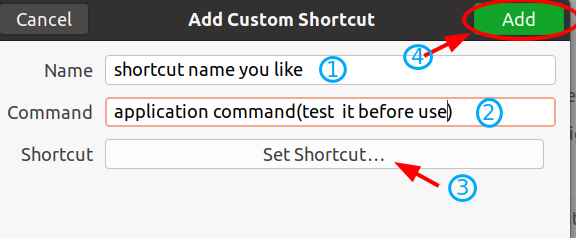

First we need to place the script that actually does the work in your documents folder, that is the /home/documents/


This is going to be a simple little task of creating some keyboard shortcuts to connect & disconnect from the vpn

Menu > Settings > System Settings or All Settings > Shortcuts > Press the  (Plus Button See Photo)





Click the + button(in previous image). The Add Custom Shortcut window will appear:
Add a custom shortcut

Type a Name to identify the shortcut, and a Command to run an application.



Click the Set Shortcut .... When the Set Custom Shortcut window opens, hold down the desired shortcut key combination.
I'd reccommend  

Connect Shortcut

```Name : Connect to ProtonVPN```

```Command : xfce4-terminal -x bash /home/user1/documents/vpncon.sh -1``` 

```Shortcut : Super/Windows Button + c```

Disconnect Shortcut

```Name : Disconnect from ProtonVPN```

```Command : xfce4-terminal -x bash /home/user1/documents/vpncon.sh -2 = Disconnect from VPN```

```Shortcut : Super/Windows Button + d```
